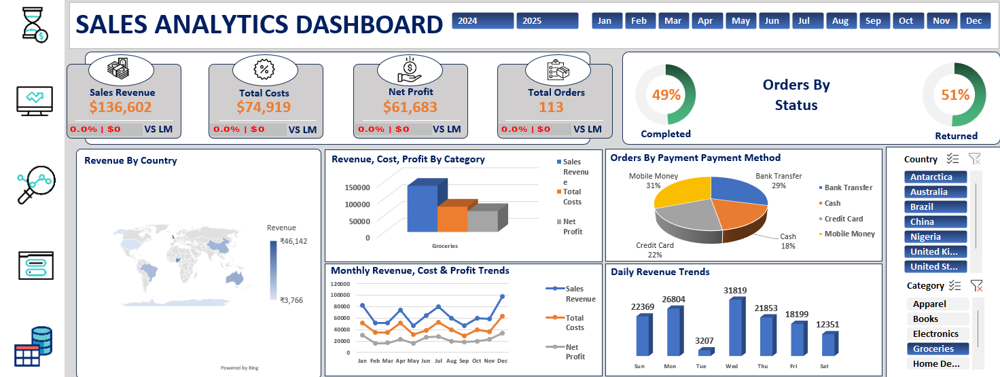

# Dynamic Sales Dashboard (VBA)

 

---

## Project Overview

This project contains a **Dynamic Sales Dashboard built in Excel with VBA macros**. The workbook allows interactive exploration of retail sales data, automated KPI tracking, and streamlined reporting workflows. It is designed to demonstrate practical Excel dashboarding, automation, and business analytics skills.  

The dashboard provides actionable insights into sales performance, revenue, profit, and product trends across categories and countries, making it ideal for business decision-making.

---

### Highlights
- Interactive Excel dashboard with dynamic charts and KPIs  
- Automated calculations and reporting using **VBA macros**  
- User-friendly **Sales Form** for streamlined data entry  
- Supports filtering by Product, Category, Country, and more  

---

## Dataset

- **File:** `Dynamic-Sales-Dashboard-Excel.xlsm`  
- **Sheets:** Retail Store Sales, Dashboard, Analysis, Sales Form, KPI, Cost Per Unit  
- **Data:** Raw transactional sales data including Customer Name, Product, Category, Quantity, Unit Price, Revenue, Profit, and other key metrics  

---

## Dashboard Features

- Interactive charts for **Sales, Profit, and Revenue**  
- Dynamic filtering using **slicers**  
- Automated KPI calculations powered by **VBA macros**  
- Data entry via a **Sales Form**  
- Backend cost references for margin calculations  

---

## Screenshots

| Screenshot | Description |
|------------|-------------|
|  | Full interactive dashboard view with KPIs and slicers |
|  | Analysis sheet showing trends and breakdowns |
|  | Sample of raw sales data powering the dashboard |
|  | VBA-powered interactive sales entry form |

---

## How to Use

1. Download `Dynamic-Sales-Dashboard-Excel.xlsm`.  
2. Open in **Microsoft Excel (desktop recommended)**.  
3. Enable macros when prompted to allow automated features.  
4. Explore KPIs and charts in the **Dashboard** sheet.  
5. Add new data using the **Sales Form** — macros append it to the Retail Store Sales sheet.  
6. Refresh PivotTables manually or via macro buttons as needed.  

---

## Tools & Technologies

- Microsoft Excel (Office 2016+ recommended)  
- PivotTables, Charts, and Slicers  
- VBA Macros for automation  
- Formula-driven KPI calculations  

---

## Backend Sheets

- **KPI:** Handles automated calculations powering dashboard visuals  
- **Cost Per Unit:** Stores reference data used for cost and margin calculations  

---

## Why This Repo

This project demonstrates practical Excel skills that hiring managers value:  
- Building **interactive dashboards**  
- Automating workflows with **VBA**  
- Turning transactional data into **stakeholder-ready insights**  

---

## Author

**Abdul Furkhan** – [GitHub Profile](https://github.com/abdul-furkhan)  
Developed this dashboard independently to showcase **Excel dashboarding, VBA automation, and business analytics** skills.  

---

## License

This project is licensed under the **MIT License** – see the LICENSE file for details.
